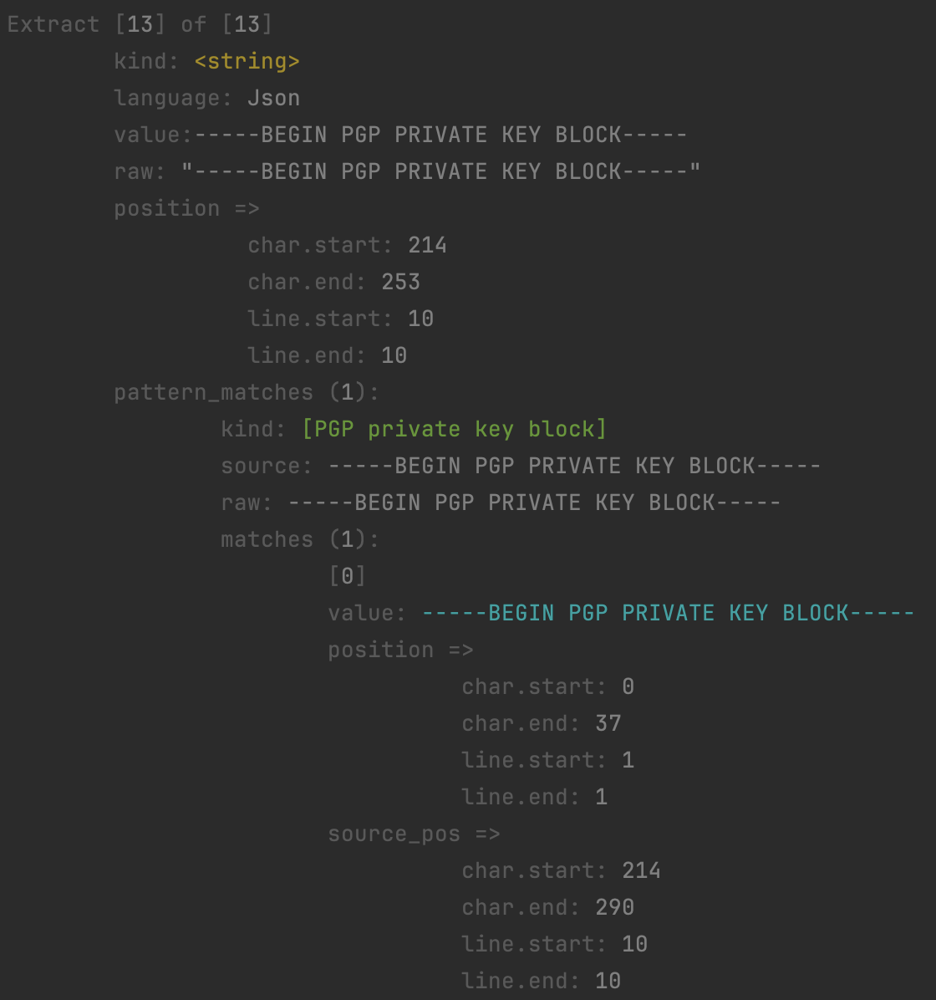

# Introduction

OxideSerpentineString is a library with a goal to reduce False Positive Rate (FPR) of detecting RegEx patterns in source
 code (Python, JavaScript, etc.) and data (JSON, TOML, CSV, etc.).

## Features

* **[_High performance_](https://github.com/mariomka/regex-benchmark)** Library
  * [Rust](https://www.rust-lang.org/) programming language which is very high performance, especially 
   when [compared](https://marshalshi.medium.com/performance-comparison-rust-vs-pyo3-vs-python-6480709be8d) to 
   interpreted languages such Python 
  * [PEST](https://pest.rs/) Parsing Expression Grammar (PEG) Parser Generator which not only offers richer 
  functionality than typical RegEx for certain use cases, but is also exceptionally efficient.
  * Rust [regex](https://crates.io/crates/regex) crate which is one of the highest performing regular 
  expression engines available (Hyperscan is superior in raw performance, but not as portable)
* **Python 3.x** bindings allowing for the Python scripts to use python's **import** to access functionality.
* **Extract string literals** from supported languages (Python, JavaScript) and data structures (JSON, TOML, CSV)
* **Secret Detection** via Regular Expression matching against known secrets (Google API Key, etc.)
* **Metadata** for string literal extracts, and regex matches:
  * Line of Code (start, end)
  * Character position (start, end)
  * Position information in both the **Source Text** and the **String Literal Extract**
    * The ability to identify where a regex match occurred not only in the entire body, but the string itself means it 
    is possible to determine whether the match is a substring or part of a larger string.
    * This information is useful because it can ba used to determine whether a pattern is part of a larger document/file
    or whether it is part of a single configuration or key/value pair
    * It also makes it easier to pinpoint exactly where a match occurs. Most similar engines will only determine the 
    start line number (line of code, or LOC) but if the match occurs in a larger string body, then it will not 
    necessarily indicate the _**exact**_ place in the source text body, or the string literal where a match occurred.
* **Rust RegEx engine** provided to Python via function calls, which is _**upto 440%**_ times faster than the native 
Python 3.x regular expression library.
* **Source-code language detection** via a fork of [Hyperpolyglot](https://github.com/monkslc/hyperpolyglot) which is an 
implementation of the GitHub [Linguist](https://github.com/github-linguist/linguist) project, which is used by GitHub 
as the engine of its own language detection feature. A custom fork was necessary in order to analyse strings without 
providing direct access to the file on a local filesystem.
* **Strings are un-escaped** increasing pattern detection coverage
  * It is likely that there are occurrences where findings are produced because a string contains escaped strings.
  * Character combinations consisting of a backslash (\) followed by a letter or by a combination of digits are called 
 "escape sequences." To represent a newline character, single quotation mark, or certain other characters in a character
constant, you must use escape sequences. 
source: [Microsoft C++ Overview](https://learn.microsoft.com/en-us/cpp/c-language/escape-sequences?view=msvc-170)
  * There are certain circumstances where escape sequences are absolutely necessary, for instances when the string 
contains the same characters required to define a string (typically: " ", ' ') 
  * For example:
    * Plain Text: my secret password is "1234" and nobody knows
    * String Literal: "my secret password is \\"1234\\" and nobody knows"
  * This presents a problem for pattern detection because some strings may or may not be escaped
  * **This problem is solved in this library because _all strings are un-escaped automatically_**

## Recommended Improvements

#### Features
* Add parsers for more languages (Java, C, C++, etc)
  * Make parsers more generic to the _style_ to avoid creating parsers for every language
* Procedural Macro (or other methods) to reduce redundant code
* Support for loading regular expressions from a configuration file
* Additional parser grammar to extract variable or argument names
  * This can be used with additional logic to check if the string is being assigned to a 'password' variable

#### Performance
* Consider migrating to using the Hyperscan Regular Expression engine
  * The Rust [Regex crate](https://crates.io/crates/regex) is very high performance (44x Python), but there may be
    (an) even more performant option(s) available, but they are not as portable. 
  * [Hyperscan](https://github.com/intel/hyperscan) is the fastest Regular Expression engine available 
  ([rust crate](https://docs.rs/hyperscan/latest/hyperscan/)). It is made by Intel, so they have no interest in 
  supporting non-intel platforms such as ARM. This means that Hyperscan is not available for Modern Macs, embedded 
  hardware or certain low-cost kinds of cloud architecture. To fix this gap, 
  [vectorscan](https://github.com/VectorCamp/vectorscan) is a community fork of Hyperscan to support multiple 
  architectures, explicitly AArch64 (Arm 64 bit). The hyperscan rust crate had a 
  [pull request](https://github.com/flier/rust-hyperscan/pull/28) to provide this capability, but it was not 
  accepted/merged. [Nosey Parker](https://github.com/praetorian-inc/noseyparker) is a rust based secret scanning tool 
  which incorporates vectorscan into the project starting from 
  [Nosey Parker v0.13.0](https://github.com/praetorian-inc/noseyparker/releases/tag/v0.13.0).
  * This is a relatively trivial task if ARM is not a required deployment target
* Consider migrating to PEST alternatives
  * [faster-pest](https://github.com/mubelotix/faster-pest)
  * [nom](https://github.com/rust-bakery/nom) ([Pest vs Nom](https://unhandledexpression.com/general/2018/10/04/no-pest-is-not-faster-than-nom.html))
  * [Benchmarks](https://github.com/rust-bakery/parser_benchmarks)

## Examples

### String literal extraction
_The following is a regular expression match produced against a string extract._

### Regular Expression pattern match
_The following is a regular expression match produced by matching a pattern against an **extracted string**._

